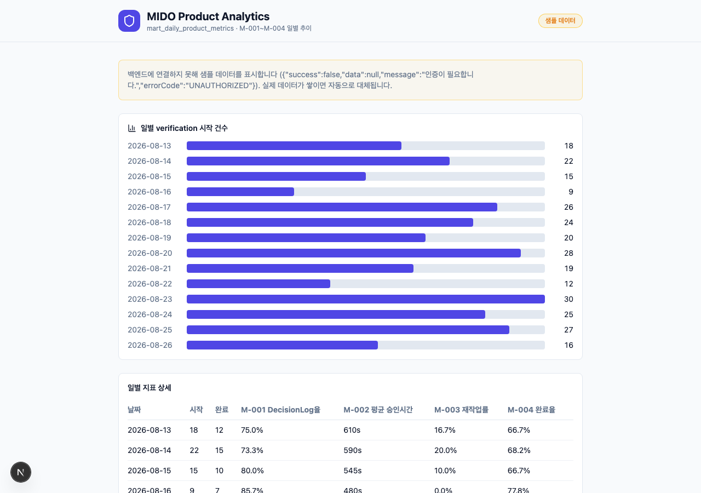

# DA-05 Portfolio Case Study — MIDO Product Analytics

> 채용 담당자/면접관이 3초 안에 훑어볼 수 있도록, Reddit 현직자 팁 구조(Title & Summary →
> Business Problem → Data & Tech Stack → Data Cleaning & Analysis → Key Insights & Dashboard →
> Business Recommendations)를 그대로 따른 포트폴리오 문서다. 다른 DA 문서(`DA-01~04`)가
> 엔지니어링 관점의 상세 스펙이라면, 이 문서는 "결과를 어떻게 보여줄 것인가"에 집중한다.

## 0. 문서 목적 — 이 섹션이 실제로 있었는가?

`DA-02`~`DA-04`는 인덱스/쿼리/마이그레이션 같은 기술 문서였고, "매출 증대/이탈 방지" 같은
비즈니스 언어로 쓰인 Title/Business Problem/Recommendations 섹션은 **없었다.** 아래는
그 갭을 메우기 위해 이번에 새로 작성 + 구현한 내용이다.

---

## 1. Project Title & Summary

**MIDO — AI가 만든 코드에 "책임 있는 결정"을 강제하는 검증 레이어**

한 줄 요약: AI가 생성/수정한 코드를 그대로 merge하기 전에 위험 근거(CVE/CWE)를 자동
수집하고, 사람이 근거를 보고 USE/FIX/IGNORE를 결정하도록 강제한 뒤, 그 판단 과정을
`DecisionLog`로 남겨 "누가 왜 승인했는지" 항상 추적 가능하게 만드는 백엔드 + 대시보드.



*위 캡처는 `GET /api/da/dashboard/daily-metrics`가 반환하는 스키마를 그대로 렌더링한
화면(`/mido/da/dashboard`)이다. 실사용 verification 이벤트가 아직 충분히 쌓이지 않아
노란 배지로 표시된 샘플 데이터로 채워져 있으며, 실제 이벤트가 쌓이면 동일 화면이
자동으로 실데이터로 바뀐다 (`web/src/app/da/dashboard/page.tsx`).*

---

## 2. Business Problem

"기술 연마용" 프로젝트가 아니라, 아래 세 가지 실제 의사결정 문제를 풀기 위해 만들었다.

| 문제 | 왜 비즈니스 문제인가 | 관련 Business Question |
| --- | --- | --- |
| AI 코드 제안을 그냥 merge하면 보안/품질 사고가 사람 눈을 거치지 않고 배포된다 | 배포 후 취약점 대응 비용 > 배포 전 리뷰 비용 | BQ-002, BQ-005, BQ-008 |
| "누가 이 코드를 승인했는지" 감사(audit) 시점에 추적이 안 되면 컴플라이언스 리스크가 생긴다 | 감사 대응 인건비, 규제 대응 실패 리스크 | BQ-008, M-005 |
| 리뷰어 승인 대기 시간이 길어지면 릴리즈 리드타임이 늘어난다 | 팀 생산성 = 매출 실현 속도 | BQ-003, M-002 |

`da/DA-04-document-index.md`가 가리키는 `spring/src/main/resources/db/migration/V1__analytics_requirements.sql`에
이 문제들을 **BQ-001~BQ-010(비즈니스 질문)**, **M-001~M-005(지표)** 로 이미 계약(contract)
형태로 정의해뒀다 — 즉 "무엇을 측정할지"부터 먼저 합의하고 파이프라인을 만든 구조다.

---

## 3. Data & Tech Stack

| 레이어 | 기술 | 역할 |
| --- | --- | --- |
| 소스 시스템 | Spring Boot 3.5 (Java 21) + PostgreSQL | `verification_data`, `decision_log`, `risk_assessment`, `approval` OLTP 원본 |
| 마이그레이션/버전 관리 | Flyway (`V1`~`V7`) | 스키마 + 지표 계약(metric contract) + 마트 뷰를 코드로 버전 관리 |
| 변환 계층 (ELT) | PostgreSQL View 기반 dbt 스타일 레이어링 | `stg_*` (staging) → `int_*` (intermediate) → `fct_*` (fact) → `mart_*` (mart) |
| 서빙 API | Spring MVC REST (`/api/verifications`, `/api/da/dashboard`) | LOB 제외 Projection, Pagination, mart 뷰 서빙 |
| 시각화 | Next.js 15 + React 19 (커스텀 CSS 차트, 외부 BI 미사용) | `/mido/da/dashboard` — 일별 M-001~M-004 추이 |
| 취약점 근거 소스 | OSV, NVD, GitHub Advisory, CISA KEV, MITRE CWE, OWASP | AI 위험도 판단의 1차 근거 |
| AI 서비스 | FastAPI (Python) | 코드 dependency 추출 + LLM 기반 위험 설명 |

리스트/바인더 형태 요약: **Java 21 · Spring Boot 3.5 · PostgreSQL 16 · Flyway · Next.js 15 ·
React 19 · TypeScript · FastAPI · Python**

---

## 4. Data Cleaning & Analysis

전체 코드는 노출하지 않고, 핵심 로직만 요약한다.

### 4.1 LOB(대용량 컬럼) 격리 — 목록/집계 쿼리에서 `code` 컬럼 완전 배제

```java
@Query("""
    SELECT new com.mido.verification.list.dto.VerificationSummaryResponse(
        v.id, v.inputType, v.status, v.createdAt)
    FROM VerificationData v
    WHERE (:status IS NULL OR v.status = :status)
    """)
Page<VerificationSummaryResponse> findSummaries(@Param("status") VerificationStatus status, Pageable pageable);
```

`VerificationSummaryResponse`는 `code` 필드를 아예 갖지 않아, 목록 API에서 대용량 코드가
실수로라도 응답에 섞일 수 없다 (`spring/src/main/verification/da/list/`).

### 4.2 레이어드 변환 — staging → intermediate → fact → mart

```
stg_verification_data, stg_decision_log, stg_approval  (원본 정규화, code 제외)
        │
        ▼
int_verification_lifecycle, int_decision_cycle, int_rework_cycle  (파생 타임스탬프/사이클)
        │
        ▼
fct_verification, fct_decision, fct_approval  (분석용 fact)
        │
        ▼
mart_daily_product_metrics, mart_team_quality, mart_ai_operations  (서빙용 mart)
```

각 모델은 `analytics_model_catalog`에 grain·PK·source·refresh policy·owner·민감도(sensitivity)·
품질 테스트까지 메타데이터로 등록돼 있다 (`V5__data_requirements.sql`).

### 4.3 지표 계약(Metric Contract) — "정의부터 합의"

M-001(DecisionLog 작성률), M-002(승인 시간), M-003(재작업률), M-004(검증 완료율),
M-005(감사 수작업 시간)는 각각 분자/분모/제외 정책/timezone 정책/late event 정책을
`analytics_metric_contract` 테이블에 코드로 박아둬서, "이 숫자가 왜 이렇게 나왔는지"를
사람마다 다르게 해석할 여지를 없앴다.

---

## 5. Key Insights & Dashboard

**라이브 데이터 소스:** `GET /api/da/dashboard/daily-metrics?days=30` (신규 구현,
`spring/src/main/verification/da/dashboard/`) → `mart_daily_product_metrics` 뷰를
`JdbcTemplate`로 직접 조회해 반환한다.

**대시보드 화면:** `/mido/da/dashboard` (`web/src/app/da/dashboard/page.tsx`, 신규 구현) — 위 1번 섹션 캡처 참고.

이 프로젝트는 아직 실사용자 트래픽이 없는 MVP 단계라, "숫자 기반 인사이트"는 실측치가
아니라 **위 캡처의 샘플 데이터로 시뮬레이션한 해석 예시**다 (정직하게 라벨링됨). 실데이터가
쌓이면 동일한 API/화면이 그대로 실측 인사이트를 보여준다.

| # | 인사이트 (샘플 데이터 기준) | 근거 |
| --- | --- | --- |
| 1 | verification 시작 건수가 요일별로 12~30건까지 2.5배 변동 → 리뷰어 배치를 요일별 정적 배분이 아니라 수요 기반으로 조정할 여지가 있다 | 8/13~8/26 시작 건수 추이 (막대 차트) |
| 2 | M-003 재작업률이 시작 건수가 많은 날(8/20: 28건, 8/23: 30건)에 각각 28.6%, 30.4%로 다른 날 평균(약 15%)보다 뚜렷하게 높다 | 일별 지표 상세 테이블 |
| 3 | M-002 평균 승인 시간이 470~715초(약 8~12분) 구간에서 요청량과 함께 늘어나는 패턴 → 승인이 자동화되지 않고 리뷰어 가용 시간에 의존하고 있음을 시사 | 일별 지표 상세 테이블 |
| 4 | M-001 DecisionLog 작성률은 73~92%로 매일 100%에 못 미침 → 판단 없이 완료 처리되는 verification이 요일 상관없이 상시 존재 | 일별 지표 상세 테이블 |

---

## 6. Business Recommendations (Next Steps)

가성비(effort 대비 impact) 기준으로 정렬했다.

| 우선순위 | 제안 | effort | 기대 impact | 근거 |
| --- | --- | --- | --- | --- |
| 1 | **재작업률(M-003) 급증일 알람** — `mart_daily_product_metrics.m003_rework_rate`가 전일 대비 임계치(예: +10%p) 이상이면 Slack 알림 | 낮음 (기존 뷰 재사용, cron + webhook만 추가) | 재작업 원인(특정 팀/가이드라인 미준수)을 당일 파악해 그 주 안에 교정 가능 | insight #2 |
| 2 | **승인 SLA 대시보드화** — M-002가 목표(예: 5분) 초과 시 리뷰어 리드에게 주간 리포트 | 낮음 (`/api/da/dashboard/daily-metrics` 이미 존재, 집계만 추가) | 릴리즈 리드타임 단축 → 팀 처리량 증가 | insight #3, BQ-003 |
| 3 | **DecisionLog 미작성 verification 주간 리포트** — M-001 분모-분자 gap을 리스트업해 담당자에게 전달 | 낮음 (기존 `GET /api/verifications?status=DONE` + decision_log LEFT JOIN NULL 필터) | "판단 없이 완료" 사각지대 제거 → 감사 대응력(M-005) 개선 | insight #4, BQ-008 |
| 4 | **decision_log append-only 제약 적용** — `DA-02` §12에서 다음 우선순위로 남겨둔 항목을 실제 DB 제약(UPDATE/DELETE 금지 트리거)으로 승격 | 중간 | 판단 이력 조작 불가 → 컴플라이언스/감사 신뢰도 확보 | Business Problem #2 |
| 5 | **AI 근거 제공 여부 A/B 비교 (BQ-002)** — `mart_ai_operations`와 `decision_log`를 조인해 "AI 근거가 붙은 verification"과 "안 붙은 verification"의 DecisionLog 작성률 비교 | 중간 (조인 쿼리 신규 작성 필요) | AI 근거 UI 투자를 계속할지 데이터로 검증 | Business Problem #1, BQ-002 |

---

## 참고 문서

| 문서 | 내용 |
| --- | --- |
| [DA-01-data-performance-guide.md](./DA-01-data-performance-guide.md) | 데이터 모델링, ETL, Airflow, 모니터링 상세 |
| [DA-02-db-efficiency-summary.md](./DA-02-db-efficiency-summary.md) | DB/쿼리 효율화 구현 현황 |
| [DA-03-efficiency-summary.md](./DA-03-efficiency-summary.md) | 코드+DB 효율화 통합 요약 |
| [DA-04-document-index.md](./DA-04-document-index.md) | 실제 구현된 DA 코드/마이그레이션 인덱스 |
